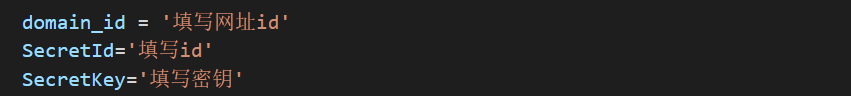
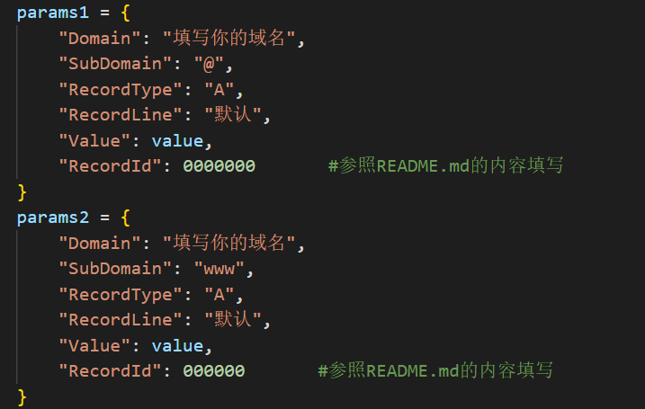
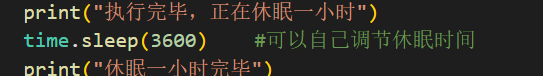

# ddns

### main.py是负责更新ddns解析的脚本，fuc.py是用于拆分json字符串的工具脚本
### 该脚本会更新默认的@解析和www解析，即可以通过http://xxxx.com与http://www.xxx.com两种方式访问

## main.py的使用

#### 在此处填写你们在腾讯云上获得的密钥和网址id(具体获得方法请参照文末博客园链接)

#### 在此处填写你们的域名与记录id(即RecordId)
#### 很遗憾记录id目前唯一的获取方法就是调用腾讯云的api获取，不会的请参考文末博客园的教程

#### 此处可以调节更新ddns频率，单位为秒

## 博客园链接：https://www.cnblogs.com/adamaik/p/17703949.html